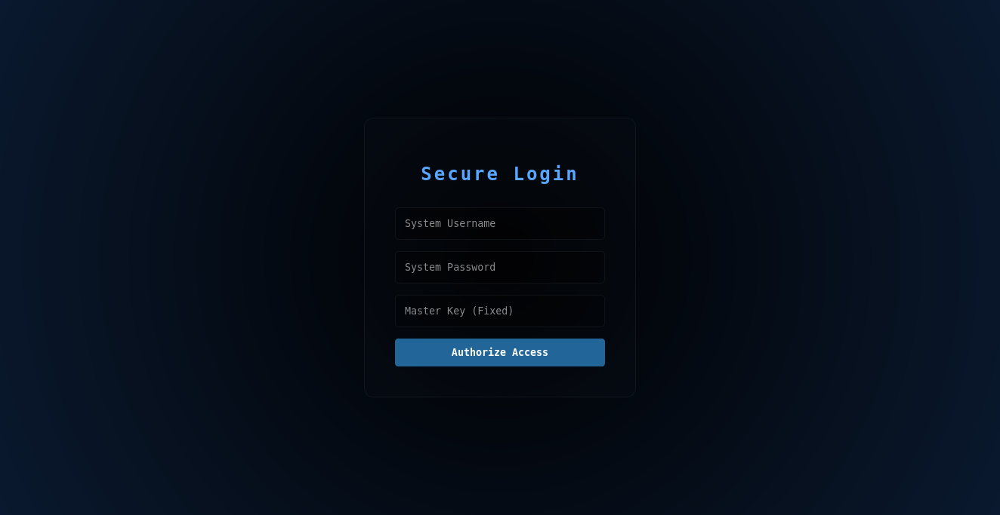
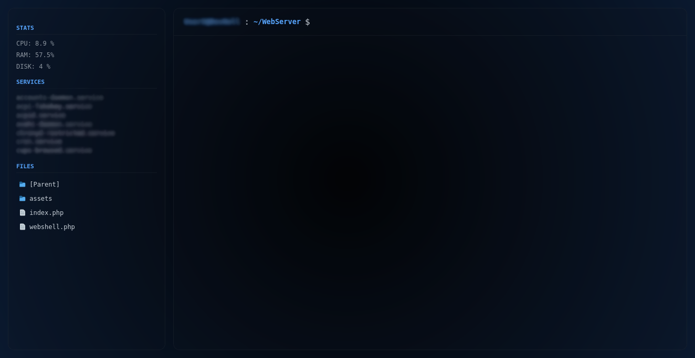

# Deep WebShell

A lightweight, terminal-inspired PHP WebShell for remote Linux administration with multi-layer authentication.

<p align="center">
  
  
</p>

## Overview

**Deep WebShell** is a minimalist, high-security web interface designed for managing Linux environments. It bridges the gap between a web browser and a native terminal, allowing for file editing, system monitoring, and command execution through a secure, encrypted-like logic.

The system uses a **Double-Auth Strategy**, validating both the native Linux System user and a secondary hardcoded Master Key to prevent unauthorized access.

## Features

- **Ghost Sudo Logic:** Intercepts `sudo` commands to maintain interface stability while executing with elevated privileges.
- **Persistent Directory Navigation:** Native `cd` implementation that maintains state across requests.
- **Double-Layer Authentication:** Validates identity through Linux PAM (via `proc_open`) and a secondary static Master Key.
- **Real-Time Monitoring:** Sidebar with live CPU, RAM, and Disk usage stats directly from the kernel.
- **Built-in Code Editor:** A "Nano-style" web editor for quick file deployments and modifications.
- **Session Auto-Destruct:** 10-minute inactivity timer to mitigate session hijacking.

## Prerequisites

To deploy this shell on your server or local environment, you need:

* **PHP 8.1+**
* **Linux Environment** (sudoers access required for the web user)
* **Fira Code font** (optional, for the intended aesthetics)

## Installation

### macOS
```bash
# Install Homebrew (if not already installed)
/bin/bash -c "$(curl -fsSL https://raw.githubusercontent.com/Homebrew/install/HEAD/install.sh)"

# Install PHP and dependencies
brew install php

# Verify installation
php -v

# Clone the repository
git clone https://github.com/BryanApolonio/Deep-WebShell.git
cd Deep-WebShell
```

### Ubuntu/Debian
```bash
# Install PHP and essential modules
sudo apt install php-cli php-common php-curl -y

# Clone the repository
git clone https://github.com/BryanApolonio/Deep-WebShell.git
cd Deep-WebShell
```

### Fedora
```bash
# Install PHP and dependencies
sudo dnf install php php-curl -y

# Clone the repository
git clone https://github.com/BryanApolonio/Deep-WebShell.git
cd Deep-WebShell

```

## Configuration

Before running, you **must** set your secondary security layer in `index.php`:

```php
// index.php
$MASTER_KEY = "YOUR_SECRET_KEY_HERE";
```

## Getting Started

1.  **Start the local server:**

    ```bash
    php -S localhost:8080
    ```

2.  **Access the Dashboard:**
    Open `http://localhost:8080` and log in with your **Linux System Username**, **System Password**, and the **Master Key** defined in the code.

## Project Structure

```text
├── assets/
│   └── img/                # UI Screenshots (login.png & terminal.png)
├── index.php               # Gateway & Double-Auth Logic
├── webshell.php            # Terminal Engine & System Monitor
└── style.css               # Brutalist Dark-Mode UI
```

## Security Warning & Disclaimer ⚠️

**I am not responsible for any security breaches, data loss, or system failures caused by the use of this software.**

While this project includes multiple layers of protection (Double-Auth, Sudo-Kill, Session Timers), **no system is 100% secure**. Exposing a WebShell to the public internet is inherently risky. It is highly recommended to:

- Use this tool only over **HTTPS**.
- Restrict access via IP Whitelisting (Firewall/`.htaccess`).
- Use it strictly for educational purposes or controlled local administration.

**Use it at your own risk.**
